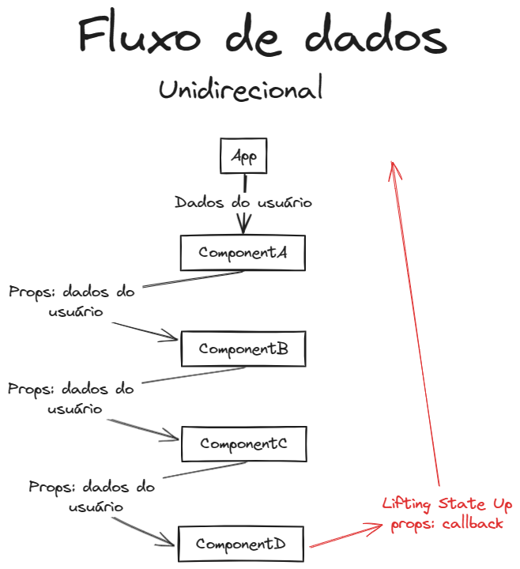
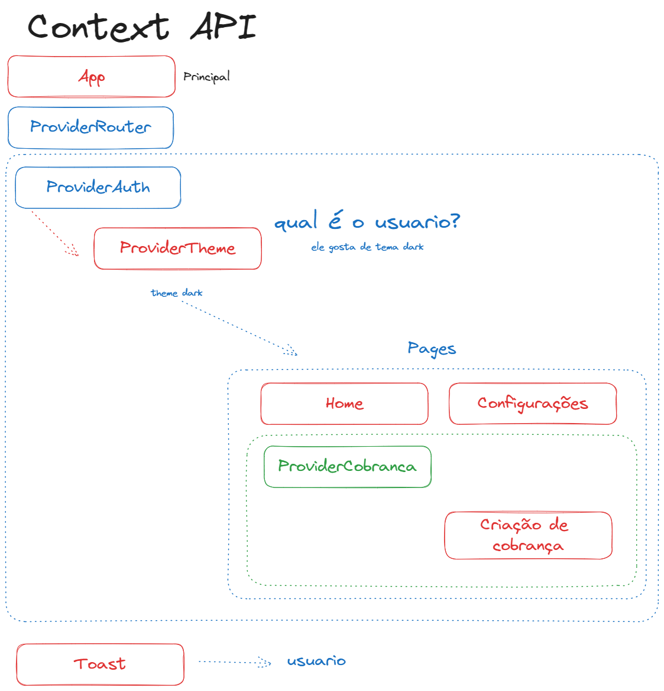

# CONTEXT API

O contexto permite que o componente pai disponibilize algumas informações para qualquer componente na árvore abaixo dele, não importa quão profundas, sem passá-las explicitamente por adereços

### Prop Drilling

### Context API

### Material complementar
- [ContextAPI](https://legacy.reactjs.org/docs/context.html) Documentação antiga
- [createContext](https://react.dev/reference/react/createContext) Documentação atualizada
